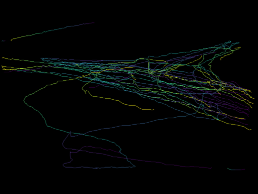

# Video to traffic flow information

This repository allows turning video data into information about traffic flows using object detection and object tracking.

## :city_sunrise: What does this do?
Cities around the world are becoming more crowded, with this repository it becomes possible to gather information about traffic flows in a transparent and privacy-friendly manner.

* Privacy-friendly: The code turns the video data into anonymous information about movement in the area.

* Transparent: Because the code and model are opensource the use of this technology is transparent.

* Traffic flow insights: A low budget method of monitoring traffic in a specific area by using only a camera.

Examples of use cases are monitoring the number of boats in the canals and detecting how many pedestrians/trucks/cars enter or leave a specific area.

> TODO: Add gif or picture of video with bounding boxes of boat, next to an animation of the drawn paths



## :hammer: How to setup?

Some initial configuration is required to run things. First we need to install all the python dependencies, and then download the network weights.

- (Optional) If you want GPU acceleration, you've got two options. Either [install pytorch with CUDA dependencies](https://pytorch.org/get-started/locally/) or [install CUDA seperately](https://docs.nvidia.com/cuda/cuda-installation-guide-linux/index.html).

- After having activated your favorite virtual environment, install the required packages using `pip` by running `pip install -r requirements.txt`. You might wanted to consider installing `numpy`, `scipy` and `sklearn` libraries using `conda`, as they are compiled with CPU-specific optimizations which can [speed things up quite a bit](http://markus-beuckelmann.de/blog/boosting-numpy-blas.html).

- Next up is downloading the YOLO network weights. You can do this by either download them [here](https://github.com/pjreddie/darknet) or by running `wget https://pjreddie.com/media/files/yolov3.weights`. Once the download is compete, place the `yolov3.weights`  in the project root directory. 

> Since we use f-strings a fair amount, python 3.6 or greater is required. Feel free to replace them if you need an older python version.

## :arrow_forward: How to use?

The application runs in two steps

1. Image detection and object tracking which is output as a "raw data" CSV file. 
2. Takes raw data and post-processes it into traffic-flow numbers ready for downstream consumption.

### 1. Image Detection & Tracking

This step is done by the `detector_sort.py` script. 

```
usage: detector_sort.py [-h] -i INPUT [-t OBJ_THRESH] [-n NMS_THRESH]
                        [--min-hits MIN_HITS] [--max-age MAX_AGE] [-o OUTDIR]
                        [-w] [--debug-trackers] [--cuda] [--no-show]

Object detection/tracking with YOLOv3 and SORT

optional arguments:
  -h, --help            show this help message and exit
  -i, --input INPUT     input directory or video
  -t, --obj-thresh OBJ_THRESH
                        objectness threshold, DEFAULT: 0.5
  -n, --nms-thresh NMS_THRESH
                        non max suppression threshold, DEFAULT: 0.4
  --min-hits MIN_HITS   A tracker needs to match a bounding box for at least
                        this many frames before it is registered. Prevents
                        false positives
  --max-age MAX_AGE     The number of frames a tracker is kept alive without
                        matching bounding boxes. Useful for tracker while an
                        object is temporarily blocked
  -o, --outdir OUTDIR	output directory, DEFAULT: detection/
  -w, --webcam          flag for detecting from webcam. Specify webcam ID in
                        the input. usually 0 for a single webcam connected
  --debug-trackers      Show the kalman trackers instead of the YOLO bounding
                        boxes. Useful for debugging and setting parameters, no
                        output is saved.
  --cuda                flag for running on GPU
  --no-show             do not show the detected video in real time

```

If you want to run using the default parameters, run

```bash
./detector_sort.py -i path/to/video_file.mp4
```

This script outputs two files, a video file contained the source video overlaid with the tracker bounding boxes. The second is a CSV containing data on the tracker bounding boxes for each frame.

> Note: We assume that the name of the video has the format `YYYYMMDDHHmmss.mp4`. We use this timestamp plus the elapsed time in the video for the final output timestamp.

### 2. Data Post-Processing

Here we do a few post-processing steps to make the previous output more manageable for downstream consumption.

```
usage: postprocess_output.py [-h] -i INPUT [-p] [-g GAP_THRESH]
                             [-a ANGLE_THRESH] [-m MOVE_THRESH] [-o OUTDIR]

Postprocessing of csv output from video-detection script

optional arguments:
  -h, --help            show this help message and exit
  -i, --input INPUT		input csv
  -p, --plot            enables plotting of paths
  -g, --gap-thresh GAP_THRESH
                        broken path threshold, DEFAULT: 20
  -a, --angle-thresh ANGLE_THRESH
                        broken angle threshold, DEFAULT: 0.5
  -m, --move-thresh MOVE_THRESH
                        static object threshold, DEFAULT: 10
  -t, --time-freq TIME_FREQ
                        time frequency used for aggregating the output,
                        seepandas.dt.round() for valid input values. DEFAULT
                        '5min'
  -o, --outdir OUTDIR	output directory, DEFAULT: detection/
```

Similarly if we want to run this with the default parameters, all you need to is run

```bash
./postprocess.py -i path/to/raw_data.csv
```

The final output should look something like this. The `--time-freq` parameter can be used to change the aggregation level, [check here](https://pandas.pydata.org/pandas-docs/stable/user_guide/timeseries.html#timeseries-offset-aliases) for what values can be used.

> TODO: Add 8 directions in example, add drawing

| ts                  | start_dir | end_dir | person | car  |
| ------------------- | --------- | ------- | ------ | ---- |
| 2019-11-04 16:49:00 | NE        | NE      | 2      | 0    |
| 2019-11-04 16:49:00 | NE        | NW      | 1      | 1    |
| 2019-11-04 16:49:00 | NW        | NE      | 1      | 0    |
| 2019-11-04 16:49:00 | NW        | NW      | 7      | 5    |
| 2019-11-04 16:49:00 | SE        | SE      | 27     | 2    |
| 2019-11-04 16:50:00 | NE        | NE      | 2      | 1    |


> TODO: Add gif or picture of video of busy street scene with output picture

## :tada: Who made this possible?

This project wouldn't be possible without all the hard work on these projects:

- [SORT: Simple online realtime tracking](https://github.com/abewley/sort) by Alex Bewley
- [YOLOv3: You Only Look Once](https://pjreddie.com/darknet/yolo/) by Joseph Redmon
